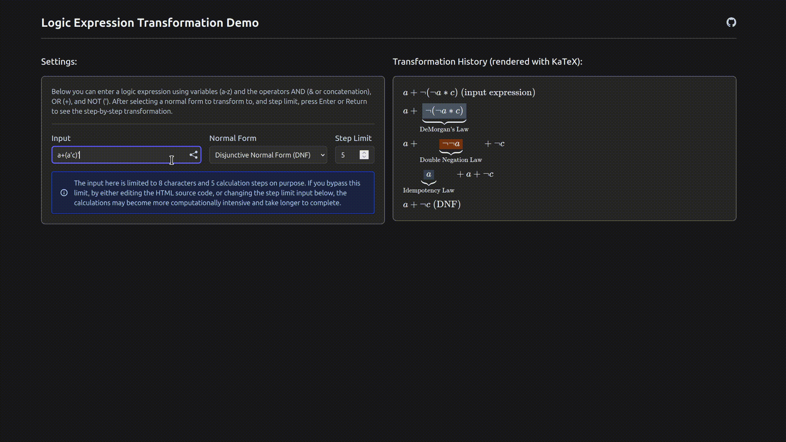

# Logical Expressions Core Module


## Description

A TypeScript module that parses, transforms, derives and evaluates logic expressions. Can be easily extended to support more operators, variables, notations, etc.

## Demo [(try it out!)](https://larsfrs.github.io/logic-expr-core/)

<div align="center">
    
</div>

## Installation

- Install from repository:
```bash
git clone https://github.com/larsfrs/logic-expr-core.git
cd logic-expr-core
npm install
npm run build
```
- Then you can use it in your project by either:
    - Creating a symlink with `npm link` (good for development)
    - Importing it directly from the `dist` folder (or copy the contents of the `dist` folder to your project)

- Install with npm:
```bash
npm install logic-expr-core
```

## Documentation

- The documentation can be found in the `/docs` folder. See the [`docs/index.md`](docs/index.md) for a complete overview.

## Goals for logic-expr-core
- Create a typescript module for visualizing algebraic transformations, specifically for boolean algebra (for now)
    - The module should be easy to extend!
- Show through code how to implement a parser, AST, evaluator, etc. in TypeScript
- Keep it small and simple, with minimal dependencies


## In development
- A tooltip system, where hovering over each expression in the transformation reveals specific information about that particular step
- A comprehensive documentation with a bunch of examples and explanations (e.g. how to implement an absorption law, how to create custom operators, etc.)
- Right now only AND OR and NOT work in the transformations, this will be extended to support other boolean operators like NAND, NOR, XOR, XNOR, etc.
- Truth tables: Functions and classes to easily implement a truth table generator
- Optimizations: For each transformation method implement (if possible):
    - Caching strategies
    - *Directed Acyclic Graphs* to handle duplicate subtrees


## Keywords
logic, boolean algebra, expressions, parser, AST, abstract syntax tree, RPN, reverse polish notation, evaluator, normal forms, DNF, CNF, NNF, TypeScript