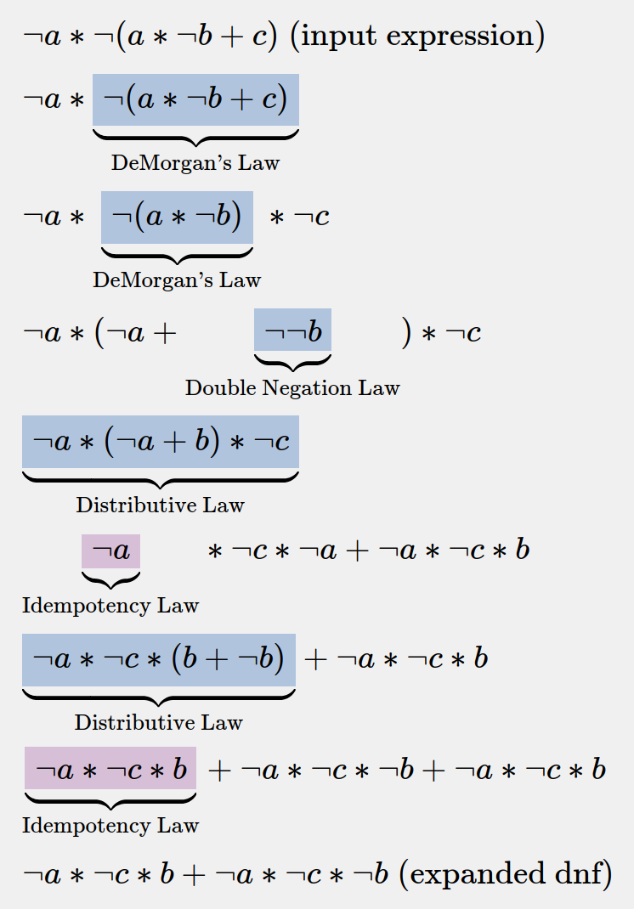

# Logical Expressions Core Module

[NPM Package Page](https://www.npmjs.com/package/logic-expr-core) | [Code Examples](docs/examples.md) | [Development Setup](docs/dev-setup.md)

## Description

A TypeScript module that parses, transforms, derives and evaluates logic expressions. Can be easily extended to support more operators, variables, notations, etc.

## Quick Examples

(See more in [demo/README.md](demo/README.md))

#### Transform `a'(ab'+c)'` to it's expanded DNF using boolean algebra:
<div align="center">
    
</div>

## Features

- parse string of expression to RPN (Reverse Polish Notation)
    - `a*!(b|c) => a b c | ! *`
    - handle different notations like postfix and prefix, add/omit "and" operators, etc.
- parse RPN to a binary AST (Abstract Syntax Tree)
    ```
    BinaryOperatorNode (AND)
    ├── LeafNode (a)
    ├── UnaryOperatorNode (NOT)
    │   └── BinaryOperatorNode (OR)
    │       ├── LeafNode (b)
    │       └── LeafNode (c)
    ```
- evaluate binary AST to boolean value
    ```typescript
    evaluateExpression("a b c | ! *", { a: true, b: false, c: true }, booleanContext);
    ```
    - returns `true`
- turn binary AST to n-ary AST (more than 2 children per node)
    ```
    NaryOperatorNode (AND)
    ├── LeafNode (a)
    ├── LeafNode (b)
    └── LeafNode (c)
    ```
- apply transformative laws to the AST
    - e.g. distributive law, absorption law, etc.
- transform the AST to different normal forms (NNF, DNF)
    - show every step of the transformation and output a list of transformations
- transform AST to DNF (Disjunctive Normal Form)
    - specifically, show every step of the transformation and output a list of transformations
- visualization of the expression tree and transformations (maybe)

## In development
- equivalence checking (using truth tables, CNF and DNF, etc.)


## Goal
- create a module for visualizing transformations of expressions in boolean algebra
- show through the code how to implement a parser, AST, evaluator, etc. in TypeScript
- make it easy to extend and customize for different use cases
- keep it small and simple, without unnecessary dependencies

## Installation

- install with npm:
```bash
npm install logic-expr-core
```

- use with a symlink, after setting up the [dev environment](/docs/dev-setup.md):
```bash
npm link # in the root of the repository
npm link logic-expr-core # in the project where you want to use it 
```